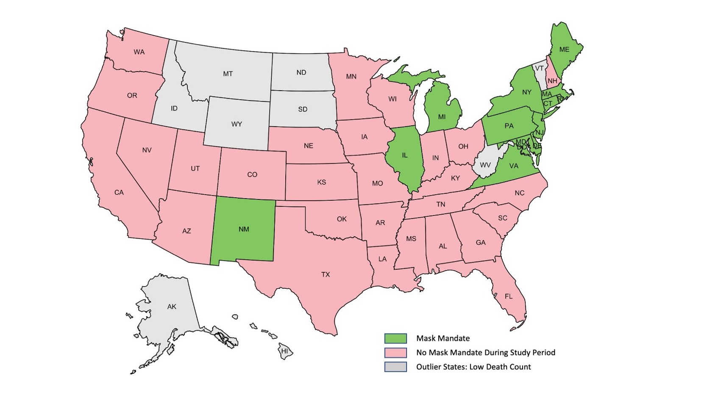

### Thesis Topic: Estimating the Effectiveness of Non-Pharmaceutical Interventions (NPIs) During COVID-19

Worldwide, governments imposed a wide range of non-pharmaceutical interventions (NPIs) in the wake of the COVID-19 pandemic. Three years later today, pandemic fatigue has set in among the world’s population as the virus attack continues in waves. To help governments contain the pandemic more effectively and to ease the burden on the population, we examined the effectiveness of individual NPI among the 42 states in the US where death count exceeded 100 during the first wave of the COVID-19 pandemic (February 1 to June 15, 2020). Two types of analyses were performed. Firstly, a prototypical Bayesian hierarchical model is employed to estimate the effectiveness of 5 commonly imposed NPIs in the US, including *gathering restriction*, *restaurant capacity restriction*, *business closure*, *school closure*, and *stay-at-home*. Secondly, the effectiveness of *facemask mandate*, the most controversial policy among states, is studied through counterfactual modeling, a variant of the prototypical Bayesian hierarchical model.

The colored states are the 42 states whose death count had exceeded 100 by the end of the study period where the grey states were the ones excluded from the analysis due to low death count.The 14 green states implemented facemask mandate policy during the study period where the 28 pink states did not implement facemask mandate policy during the study period.

**Result Visulizations (generated using ggplot in R):**
* [The effectiveness of 5 commonly imposed NPIs](./images/NPI/NPI_Rt_Reduction.png) (represented by the percentage reduction on Rt)
* [The estimated Rt trajectory for Massachusets](./images/NPI/Massachusetts_Rt.png) (all 42 states are available but only present one for illustration purpose)
* [The estimated (orange) and observed (brown) infections and deaths for Massachusets](./images/NPI/Massachusetts_Infection_Death.png) 
* [Median time-varying reproduction number estimates for states with and without facemask mandate](./images/NPI/Mask_Rt_Estimates.png)
* [Daily infection estimates for states with and without facemask mandate](./images/NPI/Mask_Infection_Estimates.png)
* [Daily death estimates for states with and without facemask mandate](./images/NPI/Mask_Death_Estimates.png)

### Project 1: COVID-19 Survival Model Comparasion

**Study Period:** March 2020 to December 2020

**Data:** the patient-level data originated from Stony Brook Medicine and were received in raw as csv files. 
* The **first raw EMR data file (dim: 3535 * 168)** contains the patient demographics data, including but not limited to mrn, encounter number, admission date, discharge date, age, gender, race, ethnicity, symtoms (cough, sore throat, etc.), pre-exisisting conditions (heart failure, COPD, CHD, etc.), and patient vital status. Most of the patients have only one encounter during the study period, but there's still some patients have multiple encounters. If this is the case, we select the most recent COVID-19 related encounter.
* The **second raw EMR data file (dim: 1048571 * 10)** contains 26 measured biomarkers, including but not limited to ALT, AST, Creatinine, C-Reactive Protein, etc. The lab will only measure the biomarkers which the physician considered necessary for the patient. The physician may start/stop asking measure a particular biomarker at any time during a patient's hospital stay. If necessary, one biomarker might being measured multiple times for the same patient within the same day.
[Sample Biomarker Data](https://github.com/lyh07749/Yuhang_Liu_Profile/blob/main/data_files/Covid_Survival_Models/sample%20biomarker%20data.csv)

**Models Implemented:**
* Cox Proportional Hazard Model
* Random Survival Forest
* Survival Tree
* Conditional Inference Forest

**Result Visulizations (generated using ggplot in R):** will be updated after journal publication.

### Project 2: Patient Self-Report Superior to Electronic Medical Record Abstraction for Identifying Positive COVID-19 Symptoms at Illness Onset [(Published)](https://www.sciencedirect.com/science/article/pii/S2773065422000049)

**Study Period:** Feburary 2020 to August 2020

**Data:** the received **survey data (dim: 316 * 1219)** was collected from patient telephone interviews and electronic medical record (EMR) abstraction. Potential risk factors assessed included participant demographics, medical comorbidities, and number and type of symptoms at illness onset. Outcome measures included symptom duration, hospitalizations, and persistence of symptoms at 12 weeks from study enrollment.

**Statistical Analysis:** Patient characteristics were described using medians (range) and frequencies (percentages) when appropriate. Percentages of pre-existing medical comorbidities, number of symptoms at onset of illness, COVID-19 testing, and escalating medical care were calculated. Percentages of each individual symptom were calculated at onset of illness and at 12 week follow up. To evaluate the association of risk factors with hospitalization (ever vs. never) and symptom chronicity (persistent vs. resolved), **univariable and multivariable analyses** were performed.  To evaluate for association of risk factors with duration of symptoms, **Spearman correlation** was used. For univariable analyses, **Chi-square tests** were used for categorical risk factors (e.g. medical comorbidities, travel history). **Wilcoxon rank sum tests** were used for numeric risk factors (e.g. number of symptoms at illness onset). For multivariable analyses, hospitalization (ever vs never) and symptom resolved status (persistent vs resolved) were analyzed as the outcomes in **logistic regression**. Explanatory variables included number of symptoms, presence of 5 key signs, symptoms at onset of illness, medical comorbidities, history of travel and demographic characteristics (i.e. age, gender and race). 

**Result Highlights:**
* Nearly 1/5 of patients with COVID-19 had no pre-existing medical conditions
* Patients self-reported nearly twice as many symptoms as recorded in medical records
* More symptoms at illness onset was associated with symptom duration and chronicity

### Project 3: Clinical Predictors of Acute Cardiac Injury and Normalization of Troponin after Hospital Discharge from COVID-19 [(Published)](https://www.thelancet.com/action/showPdf?pii=S2352-3964%2822%2900010-X)

**Study Period:** March 2020 to June 2021

**Data:** All data originated from the Montefiore Health System, one of the largest healthcare systems in New York City located in the Bronx, the lower Hudson Valley, and Westchester County. The Montefiore Health System serves a large, low-income, and racially and ethnically
diverse population in the Bronx environs that was hit hard by COVID-19 early in the pandemic. The **data (dim: 1115 * 45)** was already being de-identified and cleaned when received. Demographics, chronic comorbidities, vital signs and laboratory tests were collected.

**Statistical Analysis:** Patients were considered to have ACI if they had a serum troponin T (TNT) level above the 99th percentile upper reference limit (0.014 ng/mL) any time during hospitalization. Group comparisons (recovery vs non-recovery) of categorical variables were performed using the **Chi-squared test**. Group comparison of continuous variables in medians and interquartile ranges (IQR) were performed using the **Wilcoxon test**. All predictive models (**Classification and Regression Tree, Random Forest, and Neural Network**) employed 80% training data and 20% testing with ten-fold cross validation, implemented in R. 

**Result Visualizations (generated using ggplot in R):**

Persistent cardiac injury is common among COVID-19 survivors. Readily available patient data accurately predict ACI recovery post-discharge. Prediction of ACI recovery post-discharge using the top predictors (troponin, creatinine, lymphocyte, sodium, lactate dehydrogenase, lymphocytes and hematocrit) at discharge yielded 63.73%-75.73% accuracy. Early identification of at-risk patients could help prevent long-term cardiovascular complications.

* [Histograms of TNT level at different time points](./images/ACI/ACI_1.jpg)
* [Predictive models at discharge using CART, random forest, and neural network](./images/ACI/ACI_2.jpg)
* [Bar charts of top predictors at different time points](./images/ACI/ACI_3.jpg)

### Project 4: COPE Study: Identify Potential Contributors to Maternal Stress During COVID-19

**Study Period:** March 2020 to December 2020

**Data:** The received survey data **(dim: 7345 * 105)** was obtained through telephone interviews for 4400 pregnant women in wave 1 and 3000 in wave 2. The study survey were being administered every 3-4 months, following participants throughout their pregnancy and into the postpartum period. The proposed structure equation model includes following features and could be classified as follows:
* **Social Determinents of Health (SDoH):** age, race, education level, marital status, etc.
* **Covid Conditions:** pandemic-related income loss, access to outdoor, healthcare disruption, etc.
* **Control Variables:** number of parities, chronic health conditions, Gestational age， etc.
* **Stress Variables:** pandemic unprepredness stress, perinatal infection stress, pregnancy specific stress,etc.

**Models Implemented**
* **CART & Random Forest:** aiming dimentionality reduction
* **Structural Equation Modelling (SEM):** analyzing structural relationships

**Result Visualizations:** This study is still in progress and the visualizations have not been finialized (titles, labels, colors, etc.) yet.
* [CART](./images/COPE/CART.png), [Random Forest](./images/COPE/RF.png): repeat for all groups of features and stress variables, only include 1 for illustration purpose.
* [Structural Equation Model](./images/COPE/SEM_Result.png): using all available types of stress to create a lateng stress variable.

### Project 5: GA-Cares Study: Identify Potential Association Between 5-year Survival and Anesthetics Medium of Resection

The primary objective of this multi-site study is to determine if the administration of propofol for maintenance of general anesthesia during cancer surgery improves overall survival compared with general anesthesia maintained with a volatile agent. This study is still in the **patient recruiting** process. 

**Duties:**
 
* Write **SQL queries** to retrieve patients' electrical medical records from Stony Brook Medicine database.
* Match surgery dates between New York State Cancer Registry (NYCR) longitudinal data and 5 sites’ electrical medical records **using R**.
* Prepare mismatched patients’ review sheets for physicians to manually review and select the desired record.
* Extract patients’ cancer recurrence information from NYCR and update in the database yearly

### Some Visualizations (Generated Using ggplot in R)
* [Timing Plot](./images/Others/Timing.png)
* [Heatmap](./images/Others/Heatmap.jpeg)
* [Interval Plot](./images/Others/Interval_Plot.png)
* [Survival Plot](./images/Others/Survival_Plot.png)
* [Time Plot](./images/Others/Time_Plot.png)
